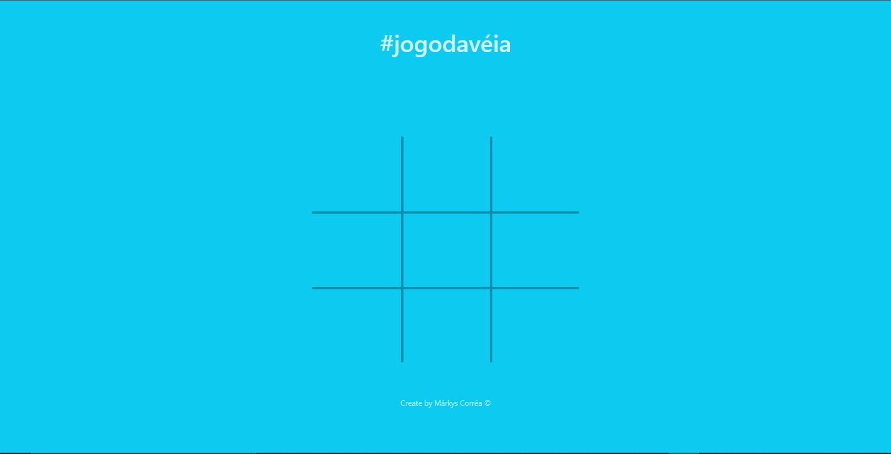
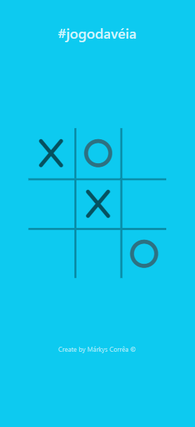

# [#jogodavéia](https://markyscorrea.github.io/jogodavelha/) ⬅️

---
Visual Web

---

Visual Mobile

## 🔖Sobre

O [#jogodavéia](https://markyscorrea.github.io/jogodavelha/) é uma aplicação baseada no famoso "jogo do galo". 

---

## 💻Teconologias Utilizadas

- HTML
- CSS
- Bootstrap
- JavaScript
- ES6
- Font Awesome
- Animate

---

## 🔎Observações

A aplicação permite 3 resultados.
Sendo eles:
- Vitória do ✖️
- Vitória do ⭕
- Empate <b>VÉIA</b>

---

Desenvolvido por Márkys Corrêa.