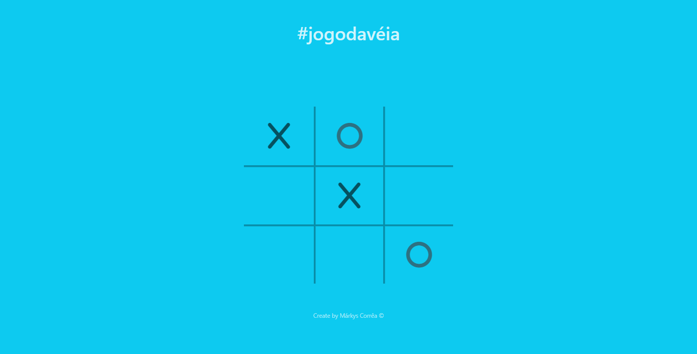

# [#jogodavéia](https://markyscorrea.github.io/jogodavelha/) ⬅️

Página Inicial

---
Visual Web

---

Visual Mobile

## 🔖Sobre

O [#jogodavéia](https://markyscorrea.github.io/jogodavelha/) é uma aplicação baseada no famoso "jogo do galo". 

---

## 💻Teconologias Utilizadas

- HTML
- CSS
- Bootstrap
- JavaScript
- ES6
- Font Awesome
- Animate
- jQuery

---

## 🔎Observações

A aplicação permite 3 resultados.
Sendo eles:
- Vitória do ✖️
- Vitória do ⭕
- Empate <b>VÉIA</b>

É possível jogar nos modos X1 e Vs PC, sendo que na segunda opção os campos do jogador 2 são preenchidos de forma randômica pela aplicação.

Em ambos os modos, o placar é preenchido ao final de cada rodada, desde que não resulte em "Velha".

O jogador que somar 3 vitórias primeiro, vence.

---

Desenvolvido por Márkys Corrêa.